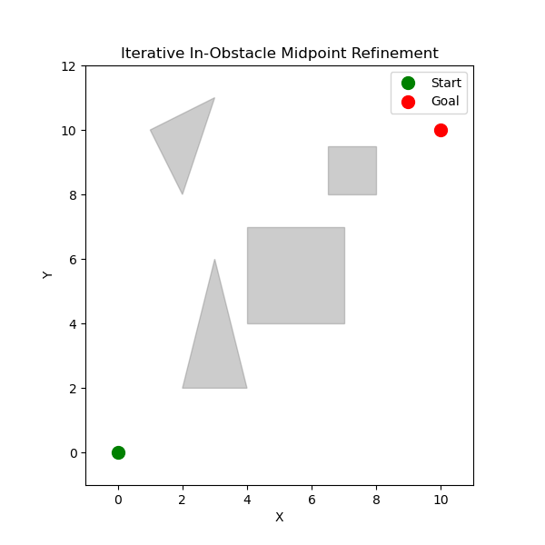
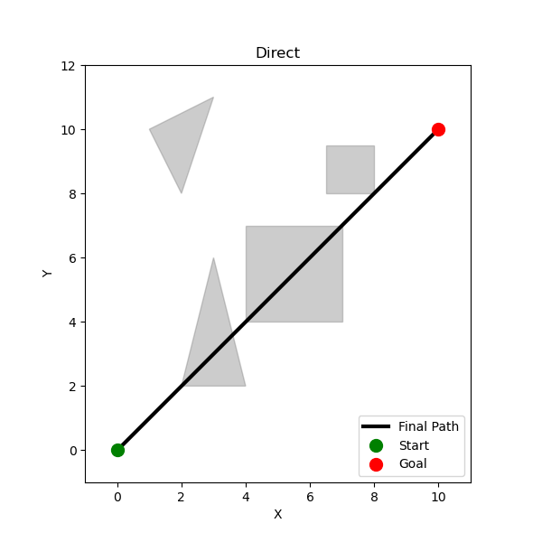
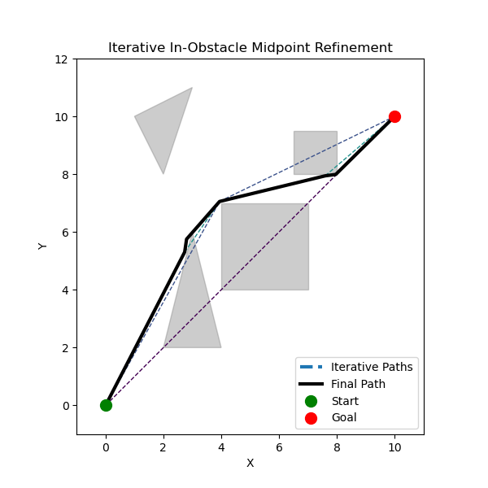

# Usage

```
images/
gif/
LICENSE.txt
README.md
main.py
main_gif.py
requirements.txt
```
1. Clone the repository with `git clone https://github.com/lachlanharrisdev/iterative-midpoint-refinement.git`
2. Navigate to project directory `cd iterative-midpoint-refinement`
3. Install requirements from file `pip install -r requirements.txt`

Usage: run `main.py` to show an example of the algorithm. Modify `obstacles[]` in class initialisation to try out different polygons, each defined as a different vertex of the polygon.

Run `gif.py` to generate each frame of a gif that showcases how the algorithm is "thinking".

---

*Read the properly formatted article at [my website](https://www.lachlanharris.dev/blog/string-pathfinding-algorithm)*

# Introduction

Call me weird, but pathfinding algorithms are some of the most fun algorithms to code. There's something about figuring out all of the cool optimisations you can apply to your very own variant of A*, how you can create a little critter that actually follows the path, or just putting random obstacles in the way and getting those little hits of dopamine when your algorithm works.

When I used to develop with unity, I was working on a [multiplayer steam game](https://store.steampowered.com/app/1190150/Paint_Warfare/) that was already published (note, I was just an assisting developer from around July 2022 - September 2024) and I was tasked with upgrading the AI system.

The game was a very, very fast paced parkour-shooter in a somewhat complicated 3d environment. The maps were quite open at the time, since the focus was on relying on your mobility to avoid death rather than stealth.

This meant the AI bots in the game could afford to, for lack of a better word, not have any level of thinking. They simply held the jump key, faced towards the closest player, and when they got close enough, they'd blow up.

I wanted to upgrade these bots to be on-par with players, and in the end, there were a couple people in the Discord server saying they genuinely confused the bots for real players.

But if you take a look at a google search for "pathfinding algorithms in unity", it's all just A*. A* is converted to use in 3d, for multiple layers, for hordes, for literally everything.

And yet it would just not work with a project like this. So how did I do it?

---

# Part 1: The Problem

When dealing with problems in 3d space, I always like to see if I can create a solution for 2d first.

Suppose we have an environment that looks like the below. It's based on a graph plane, but that doesn't necessarily mean this is grid-based.



A start point has been defined at $(0, 0)$ and an endpoint at $(10, 10)$ There are four polygons which will act as our obstacles.

What the original AI did looked something like this:



This AI simply relied on the openness of the maps and the ability to jump to traverse over obstacles to reach it's target point. If we're considering this example, the AI would've relied on how sloped the obstacles were to hopefully "push" it into the direction of the endpoint, and eventually reach it IF it doesn't get stuck in one of the crevices.

Now, we could implement A* into this example, sure. But even in this tiny, 2D scene, we're still dealing with polygons that don't fill up tiled spaces, which will cause some major gaps. Not to mention the cost of converting this scene into a tiled environment, calculating every tile that has an obstacle (and if a polygon just *slightly* enters a tile then that tile will be occupied) and *then* running that algorithm *every tick* in case of moving obstacles.

---

# Part 2: The Idea

Picture a very, very long piece of string, that for the sake of demonstration, can phase through walls. Tape one end to your end point and hold the other end in your hand.

If you follow that string, you're going to end up phasing through walls. But no matter what, at least 2 points are *not* currently inside of walls right now.

If we take the 2 points where the string starts to intersect a wall and stops intersecting a wall (so that the portion in between is all string that's currently inside of a wall), then we can use those two points to find a midpoint. All we have to do is move that midpoint towards the closet point where it is no longer inside of a wall, and we've now constructed the next portion of our pathfinding line.

The beauty of this idea is that it is reminiscent of "string pulling" techniques, where a grid-based pathfinding algorithm is then smoothed out to form a similarly-shaped path, however this technique would theoretically work in higher dimensions due to its unique method of string pulling.


## Advantages

This is a very basic explanation of my idea for this algorithm, and while I will explain the limitations later, it does offer some incredible advantages over A*, at least in my use case:

- Works perfectly in a non-tile-based environment
  
- Can work to pathfind around any shape\*
  
- Only needs to be recalculated when a vertice finds itself within an obstacle (This means that, even if there is an expensive computational cost, it'll only happen if a moving obstacle gets in the way, AND only the affected vertice will need to move)
  
- Computational cost isn't affected by range, only the complexity of obstacles in its path
  

And if we take a look at this python implementation using our same environment from before, we can see some excellent results:



## Limitations

You might've seen that this algorithm is not *entirely* perfect, and it lies in the fact that this algorithm is built for use with *any complex shape*, not just simple polygons like triangles & rectangles.


The main problem that this causes is that there is no real way of knowing where to set the midpoint when inside of an obstacle, besides the actual midpoint. In an ideal scenario, the "midpoint" would be perpendicular to the widest vertice of the shape it's inside. Then, that "midpoint" would be moved to the position of said vertice, so that the imaginary string conforms perfectly to the shape of the obstacle.

However, to keep this algorithm working for any shapes, it instead uses the normal midpoint of an intersection line, and moves that based on a raycast in both directions to find the shortest path around that obstacle.

And there are some other, more generic disadvantages too

- More computationally expensive in simpler environments (tile-based, simple polygons etc.)
  
- Assumes the width of the path follower is 0
  
- Will require modification to work with moving obstacles & moving endpoints (however, it does remain quite optimised)
  

## Future Additions

The one major addition I put into this algorithm that I will not show off in this ptyhon recreation is the ability to pathfind with moving obstacles. All it really involved was checking every tick whether or not a vertice is inside an obstacle, and if so, updating it's position the same way it was done before, then ensuring that the path to the adjacent vertices is clear.

It's a very similar scenario for the endpoint moving, since all that needs to be done is check if the endpoint has moved, and if so, check if the path from the endpoint to the previous vertex is obstructed. If not, then there's just some calculation to check if the endpoint can "connect" with any previous vertices (to simplify the path), and if so, it will delete all of the vertices ahead of the connectable vertice.

Next, if you are working in an environment that only uses shapes like squares/cubes, triangles/slopes & circles/spheres, then you could update the algorithm as mentioned before to find the optimal position to place the midpoint when inside of an obstacle. It should be positioned perpendicular to the shapes most extruded vertice in a direction, and move to that vertice so that the string perfectly conforms to that shape.

If you are sticking to the complex environment, then the next improvement to be made would be to iteratively check to see if any vertices that aren't adjacent to each other can see each other, and if so, connect them and delete the unused vertices in between. This could be an improvement or detriment, depending on how optimised you need this algorithm to be and how accurate you want the AI to be.

And the final thing to truly minimise the path length would be to keep track of all of the midpoints as a tree, where if a point is moved in one direction, the tree will store that choice and generate a second path which moves that point in the opposite direction.

---

# Conclusion

This was an incredibly fun experiment that was both rewarding and slightly humbling. Innovation in algorithms like these isn't always about reinventing the wheel, but rather creating an entirely new system that, on the outside, looks just like a wheel.

This method isn't a bandaid fix for tile-based pathfinding in non-tile-based worlds, but it's just some experimentation into what's possible with a unique method of pathfinding. It also taught me that sometimes, you need to fix your own problems rather than relying on solutions that already exist.

Reader, I hope you've learned something today, and either contribute to improving this algorithm, or find a use case in your own projects. Thanks for taking the time to read, and have a great day :)
